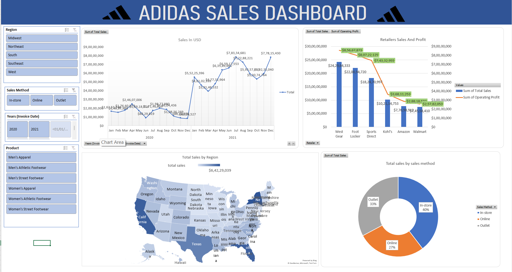

👟 Adidas Sales Dashboard (Excel) – README
📌 Project Overview

The Adidas Sales Dashboard is an interactive Excel dashboard designed to analyze sales performance across different regions, retailers, products, and sales channels. The dashboard provides business insights into revenue generation, profitability, geographic performance, and customer purchasing trends.

This dashboard helps stakeholders monitor key sales metrics and identify top-performing regions, retailers, and product categories to support data-driven decision-making.

🎯 Objectives
Analyze overall Adidas sales performance.

Track monthly sales trends over time.

Compare retailer-wise sales and operating profit.

Identify high-performing regions across the United States.

Evaluate the contribution of different sales methods.

Enable dynamic filtering through interactive slicers.

📊 Key Performance Indicators (KPIs)

The dashboard focuses on the following metrics:

Total Sales

Operating Profit

Sales by Region

Sales by Retailer

Sales by Product Category

Sales by Sales Method

Monthly Sales Trends

📈 Dashboard Components

1. Sales Trend Analysis
Line chart displaying monthly sales performance.
Helps identify seasonal trends and growth patterns.
Comparison of sales across 2020 and 2021.

2. Retailer Sales & Profit Analysis
Combined Bar and Line Chart.
Compares total sales with operating profit for each retailer.
Highlights the most profitable retail partners.

3. Regional Sales Performance
Interactive USA map visualization.
Displays sales distribution across different states.
Darker shades represent higher sales volumes.

4. Sales Method Distribution
Donut chart showing contribution from:
In-Store Sales
Online Sales
Outlet Sales
Enables analysis of customer purchasing preferences.

🔍 Business Insights Generated

Identify top-performing retailers based on sales and profitability.

Analyze regional demand patterns.

Track monthly revenue growth.

Understand customer purchasing behavior across sales channels.

Evaluate product category performance across regions.

🛠 Tools & Technologies

Microsoft Excel

Pivot Tables

Pivot Charts

Slicers

Conditional Formatting

Map Charts

Data Modeling

📂 Dataset Features

The dataset includes:

Invoice Date

Region

State

Retailer

Product Category

Sales Method

Units Sold

Total Sales

Operating Profit

🚀 Conclusion

This Adidas Sales Dashboard provides a comprehensive view of sales performance across regions, retailers, products, and sales channels. Through interactive visualizations 
and filtering capabilities, it enables efficient business analysis and supports strategic decision-making for improving sales and profitability.

📸 Dashboard Preview

Adidas Sales Dashboard – Interactive Excel Analytics Project
Analyzing sales trends, retailer performance, regional distribution, and sales channel contribution using Excel's advanced dashboarding capabilities.